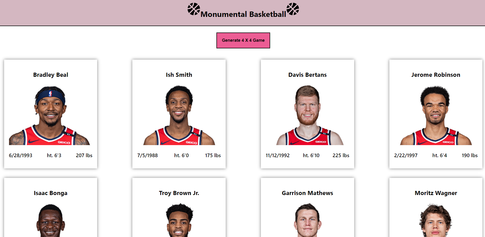

# Monumental Basketball

### Description
This application is a single-page React.js web application. Provided with the players information in the players.json file, the "generate" button will create a random 4 on 4 game. Based on the player's stats/information the application will predict the winning team.
### License

This application is licensed under MIT

### Application Demo

### Table of Contents
- [Description](#description)
- [Contributing](#contributing)
- [Tests](#tests)
- [Questions?](#questions)

### Contributing
No contributions at this time.

### Tests
N/A

### Questions
GitHub Username: (kcaseychamberlain) 

View the project in GitHub at: https://github.com/KCaseyChamberlain/monumental-basketball

View the application live hosted at: https://kcaseychamberlain.github.io/monumental-basketball/

If you have any questions, contact Casey at: caseygchamberlain@gmail.com